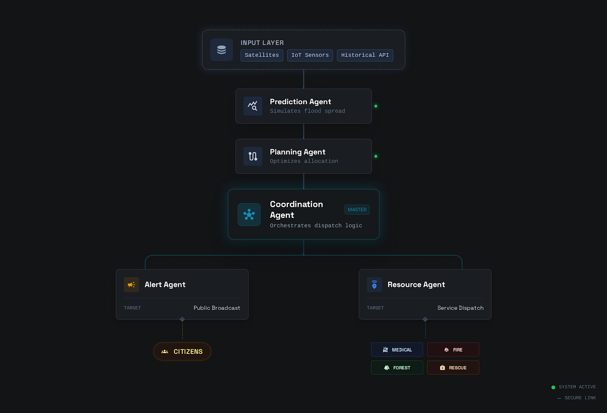

# 🌊 Flood Resilience Network – Planet AI

**A decentralized, multi-agent intelligence network for flood prediction, emergency coordination, and real-time disaster response.**

Built for the **Zynd AI Hackathon**, this project demonstrates how **trusted, interoperable AI agents** can collaborate to protect communities when floods strike and coordination delays cost lives.

---

## 🚨 Problem Overview

Flood disasters are becoming more frequent and severe, yet response systems remain fragmented:

- Weather and hydrological data live in silos  
- Emergency agencies struggle to coordinate in real time  
- Resource allocation is slow and inefficient  
- Communities receive alerts too late  

**Flood Resilience Network – Planet AI** addresses this gap by creating a **network of collaborating AI agents** that can predict, plan, coordinate, and act together.

---

## 💡 Solution Summary

We propose a **Flood Resilience Network** powered by **interconnected AI agents** that work as a collective intelligence system:

- 🌧️ **Predict floods early** using real-time weather and river data  
- 🧠 **Coordinate emergency planning** across agencies and regions  
- 🚑 **Mobilize rescue resources optimally**  
- 📢 **Alert communities proactively** with localized warnings  

Instead of one monolithic system, we use **specialized agents** that collaborate through a trusted interoperability layer.

---

## 🧠 Multi-Agent Architecture

Each agent has a **clear role**, autonomy, and the ability to communicate securely with others.

### 🔹 Core Agents

#### 1️⃣ Flood Prediction Agent
- Ingests weather forecasts, rainfall data, river levels, satellite inputs
- Uses ML + rule-based logic to assess flood probability
- Outputs:
  - Flood risk level (Low / Medium / High)
  - Expected time window
  - Affected zones

#### 2️⃣ Planning & Decision Agent
- Converts flood predictions into response plans
- Identifies evacuation zones and priority areas
- Requests resources based on severity

#### 3️⃣ Emergency Coordination Agent
- Acts as a communication hub
- Coordinates between:
  - Government authorities
  - Disaster response teams
  - NGOs & relief organizations
- Prevents duplicate or conflicting actions

#### 4️⃣ Resource Allocation Agent
- Optimizes deployment of:
  - Rescue teams
  - Boats, helicopters
  - Medical aid & shelters
- Continuously re-adjusts based on live updates

#### 5️⃣ Community Alert Agent
- Sends real-time, location-based alerts
- Supports:
  - Evacuation instructions
  - Safety guidance
  - Status updates during rescue operations

---

## 🔄 Agent Interaction Flow

## 🔄 System Flowchart

All agents communicate **peer-to-peer** and **share verified intelligence**, enabling fast, collective decision-making.

---

## 🔐 Trust & Interoperability

- Each agent has a **verifiable identity**
- Messages are **secure and encrypted**
- Agents can **discover and authenticate** other agents dynamically
- The network is **decentralized**, avoiding single points of failure

This makes the system resilient even during partial infrastructure outages.

---

## 🌍 Real-World Impact

✅ Faster flood prediction  
✅ Better coordination across agencies  
✅ Reduced response time  
✅ Optimized use of limited rescue resources  
✅ Lives saved and damage minimized  

---

## 🧪 Demo / Sandbox Environment

For the hackathon, agents operate inside a **simulated flood-response environment** where:

- Synthetic weather and river data streams are generated
- Flood scenarios escalate dynamically
- Agents collaborate autonomously in real time

This sandbox proves how agent networks outperform isolated AI systems.

---

## 🛠️ Tech Stack (High-Level)

- **Multi-Agent System Architecture**
- **Machine Learning for flood prediction**
- **Real-time messaging between agents**
- **Decentralized agent interoperability (Zynd Protocol)**
- **Simulation-based testing environment**

---

## 🚀 Future Scope

- Integration with real government APIs & IoT sensors
- Drone & satellite data ingestion
- Cross-border disaster coordination
- Mobile app integration for citizens
- AI-driven post-disaster recovery planning

---

## 👥 Team

- **Avneesh**
- **Aman Sharma**
- **Sumit Parya**

---

## 📌 Conclusion

**Flood Resilience Network – Planet AI** showcases the power of **agent collectives over isolated intelligence**.

By enabling AI agents to **predict together, plan together, and act together**, we move closer to a future where technology doesn’t just react to disasters — it **anticipates and mitigates them**.

---

### 🌊 From isolated agents to intelligent networks.  
### 🌍 From delayed response to proactive resilience.
